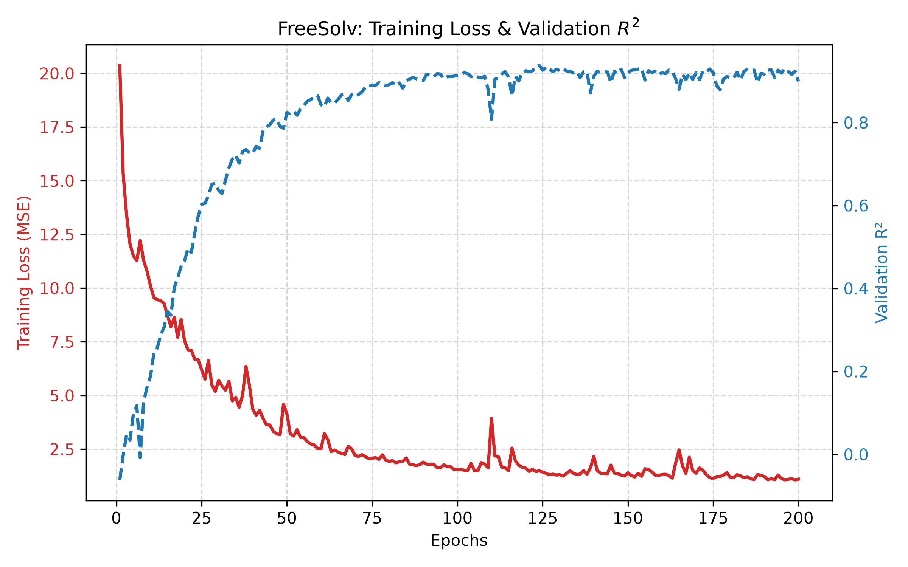
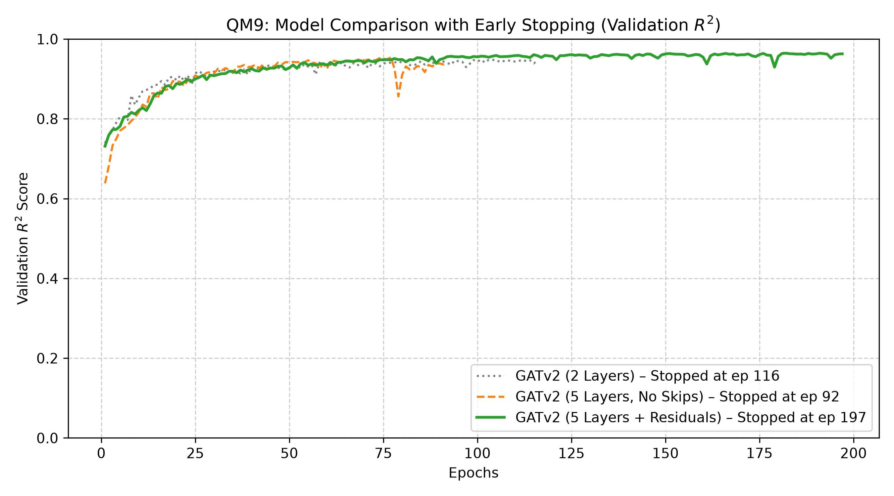

# Molecular Property Prediction: FreeSolv & QM9

This repository implements PyTorch Geometric models to predict molecular properties using two standard datasets: **FreeSolv** (solvation free energy) and **QM9** (quantum chemical properties).

## Overview & Datasets
- **FreeSolv Model:** Predicts hydration free energy ($\Delta G_{\text{solv}}$) for small molecules.
- **QM9 Model:** Predicts quantum mechanical features (e.g., HOMO/LUMO gap, dipole moment).


## Model Structure

The input SMILES strings are parsed into PyTorch Geometric `Data` graph representations using `from_smiles()`.

### FreeSolv Architecture

```python
import torch
import torch.nn as nn
from torch_geometric.nn import SAGEConv, global_mean_pool

class GNNModel(nn.Module):
    def __init__(self, hidden_channels):
        super().__init__()
        self.embeddings = nn.ModuleList([
            nn.Embedding(len(vals) + 1, hidden_channels)
            for vals in x_map.values()
        ])
        self.conv1 = SAGEConv(hidden_channels, hidden_channels)
        self.conv2 = SAGEConv(hidden_channels, hidden_channels)
        self.fc = nn.Linear(hidden_channels, 1)
```

* **Atom Embedding (`nn.Embedding`):** Maps categorical node attributes (e.g. atomic numbers) into a dense, continuous vector space (`hidden_channels`).
* **2× GraphSAGE Layers (`SAGEConv`):** Aggregates feature representations from local node neighborhoods. After 2 layers, each atom incorporates information from its neighbors and their neighbors, capturing functional groups that are relevant to solubility.

* **Global Pooling (`global_mean_pool`):** Aggregates node-level representations into a single graph-level embedding representing the entire molecule.
* **Output Readout (`nn.Linear`):** Projects the graph-level embedding onto a 1-dimensional output representing the target hydration free energy ($\Delta G_{\text{solv}}$).

### QM9 Architecture

For QM9, the model upgrades from `SAGEConv` to `GATv2Conv`. Unlike standard convolutions, GATv2 utilizes graph attention mechanisms and incorporates edge features (`edge_attr`, such as bond types). This enables the model to weight the importance of different atomic bonds dynamically.

```python
import torch
import torch.nn as nn
from torch_geometric.nn import GATv2Conv, global_mean_pool
class GNNModel(nn.Module):
    def __init__(self, hidden_channels):
        super().__init__()
        self.embeddings = nn.ModuleList([
            nn.Embedding(len(vals) + 1, hidden_channels)
            for vals in x_map.values()
        ])
        self.edge_embeddings = nn.ModuleList([
            nn.Embedding(len(vals) +1, hidden_channels)
            for vals in e_map.values()
        ])
        h_c = hidden_channels
        self.conv1 = GATv2Conv(in_channels=h_c, out_channels=h_c, edge_dim=h_c)
        self.conv2 = GATv2Conv(in_channels=h_c, out_channels=h_c, edge_dim=h_c)
        self.conv3 = GATv2Conv(in_channels=h_c, out_channels=h_c, edge_dim=h_c)
        self.conv4 = GATv2Conv(in_channels=h_c, out_channels=h_c, edge_dim=h_c)
        self.conv5 = GATv2Conv(in_channels=h_c, out_channels=h_c, edge_dim=h_c)
        self.fc1 = nn.Linear(h_c, h_c)
        self.fc2 = nn.Linear(h_c, 16)
```

* **Atom Embedding (`nn.Embedding`):** As before
* **Edge Embedding (`nn.Embedding`):** Maps categorical edge attributes (e.g. bond types) into a dense, continuous vector space (`hidden_channels`).
* **5× GATv2Conv Layers (`GATv2Conv`)** (with skip connections)**:** As before, but this time 5 layers are being used instead of 2, capturing complex molecular subgraphs. Residual skip-connections were introduced between layers to reduce over-smoothing and preserve local atomic details.

* **Global Pooling (`global_mean_pool`):** As before
* **2× Linear Layers (`nn.Linear`):** Since some of the 16 target quantum properties correlate, a second linear layer allows the network to model non-linear interactions before projecting the graph representation onto the final 16-dimensional target vector.

## Training on the RX 5700
## Hardware Acceleration: PyTorch on AMD RX 5700 (gfx1010)

To significantly speed up training, the pipeline was executed on a dedicated AMD Radeon RX 5700 GPU. However, since the `gfx1010` architecture lacks official PyTorch ROCm support out-of-the-box, there are common workarounds—such as spoofing a newer GPU architecture via `HSA_OVERRIDE_GFX_VERSION=10.3.0`. In my case this resulted in runtime instability and memory errors.

To solve this, PyTorch was compiled directly from source with native target support explicitly enabled for the `gfx1010` architecture, following the build guidelines from [PyTorch-ROCm-gfx1010](https://github.com/Efenstor/PyTorch-ROCm-gfx1010). This provided a fully functional CUDA-equivalent ROCm backend without runtime crashes.

## Results
### FreeSolv Performance

Final Test-Data R² Score: 0.857
### QM9 Model Comparison


### Key Empirical Findings

* **Graph Diameter vs. Network Depth:** Due to the small spatial size of QM9 molecules (up to 9 heavy atoms), a 2-hop neighborhood captured by 2 `GATv2Conv` layers already covers most atomic interactions. Paired with `hidden_channels=512`, the shallow model performs surprisingly strong.

* **Effectiveness of Skip-Connections:** Without residual links, expanding the architecture to 5 layers leads to training instability and premature termination via early stopping (Epoch 92). Adding skip-connections stabilizes gradient flow, enabling the 5-layer model to train up to 200 epochs and achieve the highest overall $R^2$ score.